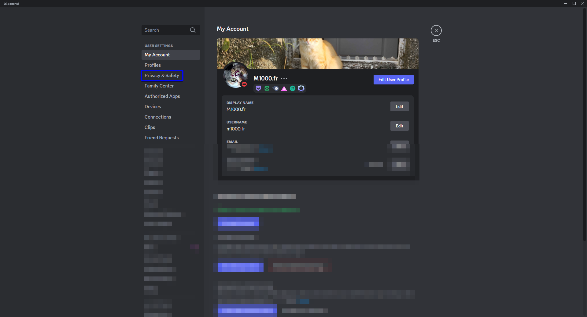
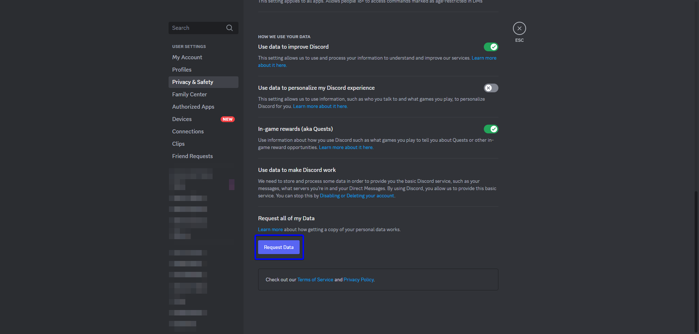
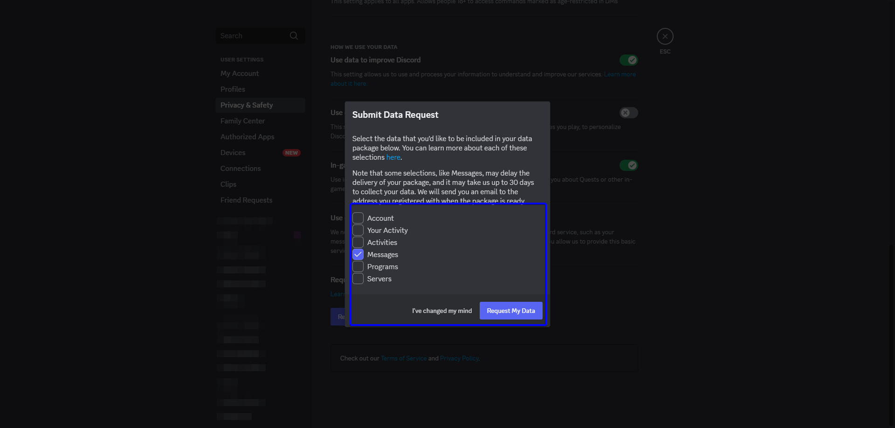

# Discord DM Deletion Script

This script allows you to delete all your direct messages (DMs) on Discord using data retrieved through a data request to Discord. It fetches the IDs of your sent messages and deletes them automatically.

## How to Request Your Data from Discord

<!-- C:\Users\M1000\Desktop\ClearMessages\imgs\1.png C:\Users\M1000\Desktop\ClearMessages\imgs\2.png
C:\Users\M1000\Desktop\ClearMessages\imgs\3.png -->

1. Log in to your Discord account.
2. Click on **User Settings** at the bottom left.
3. Go to the **Privacy & Safety** section.
   
4. Scroll down to the **Request Data** section.
   
5. Select "Messages" and click on **Request Data**.
   
6. Discord will send you a download link via email once your data is ready. This may take several days.

Once you receive and download your data, you will find a file containing all the messages you have sent, including their IDs. This file will be used by the script to delete your messages.

## Setting Up the Project

### Prerequisites

-   [Node.js](https://nodejs.org/en/) installed on your machine.
-   [Yarn](https://classic.yarnpkg.com/en/docs/install) installed to manage dependencies.
    -   `npm i -g yarn`

### Installation

1. Clone this repository or download the project files to your machine:

```bash
git clone https://github.com/M1000fr/clear-all-discord-dm.git
```

2. Navigate to the project directory:

```bash
cd clear-all-discord-dm
```

3. Install the project dependencies:

```bash
yarn install
```

4. Extract the messages file from your Discord data request and place it in the project directory. This should be look like this:

```tree
.
├── messages
│   ├── c{CHANNEL_ID}
│   │   ├── channel.json
│   │   └── messages.json
│   ├── ...
│   └── index.json
```

5. Build
```bash
yarn build
```

6. Run the script:

```bash
node . "UR_TOKEN"
```
